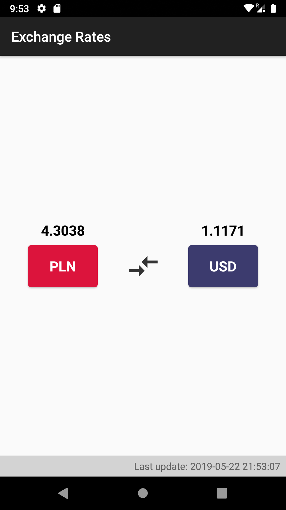
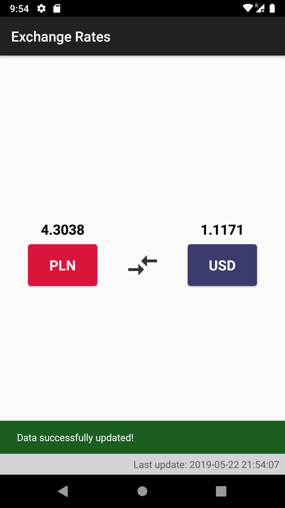
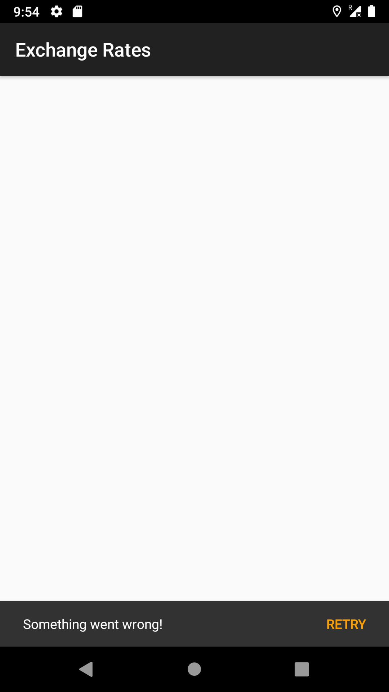
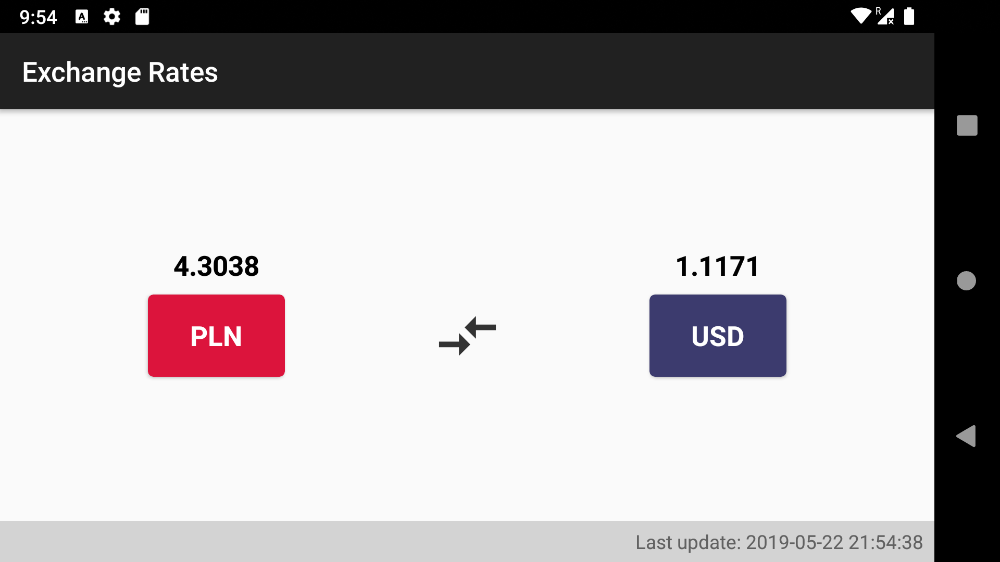

# Exchange Rates Chanllenge app

This app was created as part of a challenge, I managed to complete it within 4 hours! It's very simple and doesn't much use, however, it's consuming data from web services and is presenting it to the screen following some great android development standards and is also covered by some sample espresso tests.

## Before you run instrumented tests

In order to run instrumentation tests, you must change the build variant to **instrumentationTest** so that the server requests is mocked to a local server implemented using **MockWebServer**. Also, as some of the tests has interaction with the Snackbar component, it's necessary to **disable android animations** so that there won't be any random side effects while executing the tests.

## More Details
- Built using MVP with clean architecture;
- Dependency Injection is made using **Koin 2**;
-  **RxJava2** is used together with **Retrofit2** to make API calls;
- App supports android 23+;
- **MockWebServer** is used for the instrumentation tests.

     
## Screenshots

